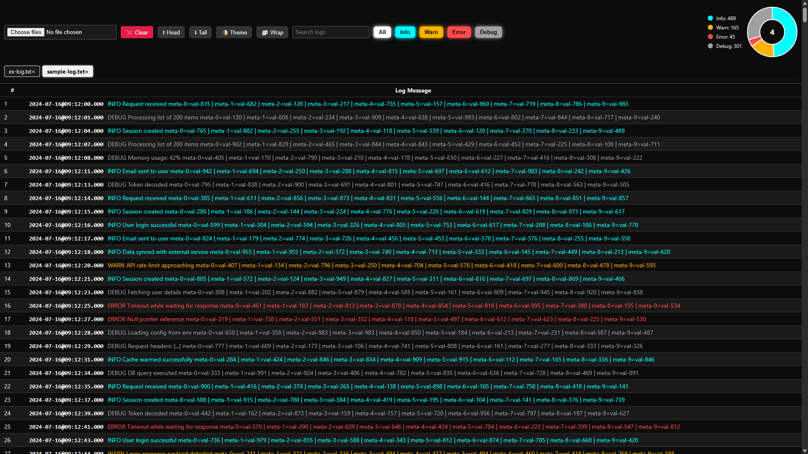

# ⚡ Dev Log Viewer

**A sleek, fully offline, multi-log file inspector built with pure HTML, SCSS, and JavaScript — zero dependencies, maximum magic.**  
Easily visualize logs, switch between files with tabs, and analyze issues in seconds using built-in filters, themes, charts, and smart scroll.

---

## 🧩 Features that Hit Hard

| Feature | Description |
|--------|-------------|
| 📁 **Multi File Upload** | Drag or select multiple `.txt` logs in one go |
| 🧙‍♂️ **Tab Navigation** | Instantly switch between uploaded files using dynamic tab UI |
| 🍩 **Log Donut Chart** | Live donut chart (Chart.js) shows log level breakdown |
| 🧠 **Keyword Filtering** | Filter by `INFO`, `WARN`, `ERROR`, `DEBUG` — toggle buttons |
| 🔍 **Instant Search** | Type anything, search results filter in real-time |
| 🧻 **Wrap Toggle** | Toggle between single-line view and wrapped log lines |
| ⏱️ **Timestamp Highlighting** | Timestamps are auto-highlighted for better scanability |
| 🌗 **Theme Toggle** | Light/Dark theme switcher using CSS custom properties |
| ⬆⬇ **Scroll Shortcuts** | Jump to top/bottom with smooth animations |
| ❌ **One-Click Clear** | Clear all uploaded files and reset view instantly |

---

## 💡 Techniques & Design Principles

- **Smart Layouts** using `flex` and media queries for responsive header, charts, and tab bar
- **Sticky Header** with dual-axis positioning to ensure top visibility on both vertical & horizontal scroll
- **Dynamic DOM Rendering**: tabs, chart, and logs are rendered/updated purely via JS
- **Semantic HTML** + ARIA-aware accessibility features
- **CSS Variables (`var(--*)`)** for consistent theming and instant light/dark switch
- **Event-Driven UI**: Listeners for file input, search, scroll, filter toggles, etc.
- **Local-Only**: No uploads or tracking — all files stay in your browser memory
- **Chart.js Integration**: Clean, colorful donut chart to visualize log levels

---

## 🎯 Tech Stack

- ✅ **Vanilla JavaScript** (ES6+)
- ✅ **SCSS / CSS** (no frameworks)
- ✅ **Chart.js** for live donut visualizations
- ✅ **No Bundlers, No Build Steps** — just open in browser and go

---

## 🌩️ Live Preview

> 🔗 <a href="https://selvasaha.github.io/log-viewer" target="_blank" rel="noopener noreferrer">Try it Now</a>

> Works offline after first load. Drop `.txt` logs and analyze on the go!

---

## 📸 Screenshot



---

## 🔥 Sample Log File

> Download this if you want to demo the viewer immediately.

<a href="example-log.txt" download>📄 Download example-log.txt</a>

Contains a big juicy mix of `INFO`, `WARN`, `ERROR`, and `DEBUG` lines, timestamps, and realistic system logs.

---

## 🛠 Dev Tips

- Works best on **modern browsers** (Chrome, Firefox, Edge)
- SVG favicon might not show properly if opened via `file://` — prefer local server:
  ```bash
  npx serve .
